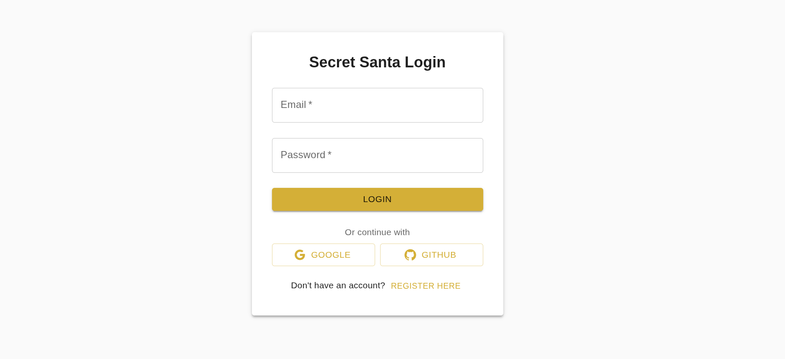
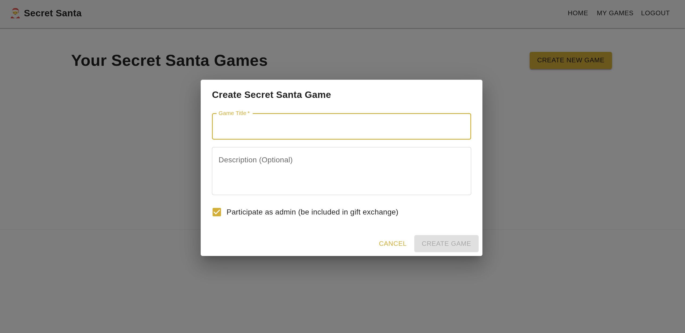
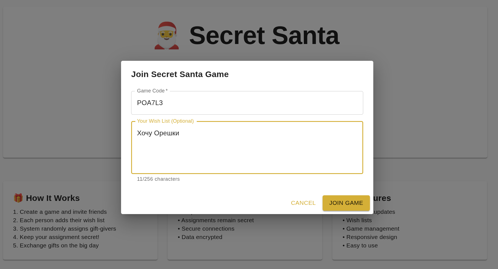
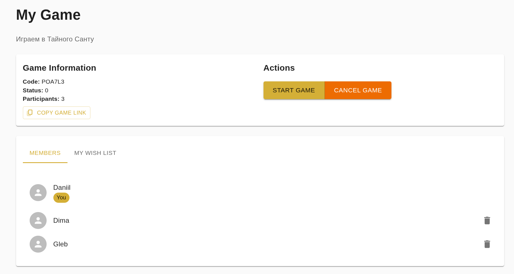
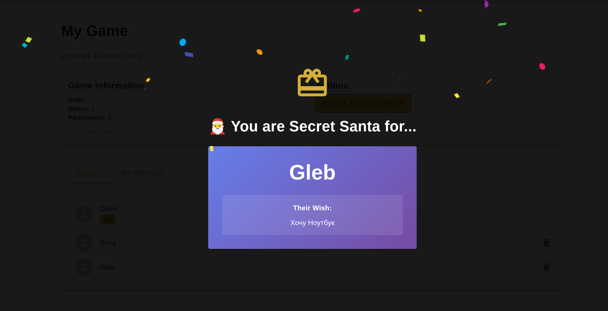
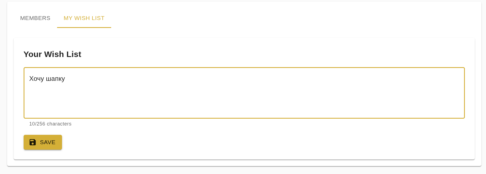

# 🎁 Secret Santa Backend API

«Тайный Санта» — это популярная новогодняя игра на обмен подарками, где каждый участник втайне готовит сюрприз для одного другого человека из группы.
Для этого необходимо распределить пары так, чтобы только дарящий знал кому дарит и пожелания к подарку. Для этого и создан данный сайт.

[](https://github.com/ice-rider/secret-santa-II)

## Команда

[TeamLead + Frontend](https://github.com/ice-rider)

[Backend](https://github.com/rvfw)


## 🚀 Основные функции API

### 🔐 **Аутентификация и авторизация**
- Регистрация через email/password
- OAuth 2.0 провайдеры: Google, GitHub
- JWT-токены с refresh механизмом
- Ролевая модель: Админ/Участник

### 🎮 **Управление играми**
- Создание игр с генерацией уникального 6-значного кода
- Вступление по коду (без публичного списка игр)
- Динамическое распределение пар (никто не получает себя)
- Режим участия/неучастия администратора

### ⚡ **Real-time функционал**
- Мгновенные уведомления о новых участниках (SignalR)
- Синхронный старт игры для всех участников
- Обновление статусов в реальном времени

### 📦 **Бизнес-логика**
- Управление пожеланиями к подаркам
- Валидация минимального количества участников (≥3)
- Защита от манипуляций после старта игры
- Безопасное распределение без пересечений


## 📸 Демонстрация работы системы

### 1. **Аутентификация и вход**
  
*Многофакторная аутентификация: email/password или OAuth (Google/GitHub)*

### 2. **Создание новой игры**
  
*Форма создания игры с выбором: участвует ли администратор в розыгрыше*

### 3. **Вступление в игру**

*Вход в игру по уникальному коду и ввод пожелания*

### 3. **Управление игрой (админ-панель)**
  
**Ключевые элементы:**
1. 🔢 Уникальный код для приглашения
2. 👥 Список участников с действиями
3. ⚠️ Кнопка удаления участников
4. 🎯 Старт игры при достижении минимум 3-х участников

### 4. **Взаимодействие участника**
  
*После старта игры: участник видит, кому дарит + пожелания к подарку*

### 5. **Изменение пожеланий**
  
*Участники могут обновлять свои пожелания до момента старта игры*

## 🏗 **Архитектурные решения**

### 📁 Структура проекта

```
secret-santa-II/
├── .env                           # Переменные окружения
├── docker-compose.yml             # Оркестрация Docker
├── docker-bake.hcl               # Конфигурация Docker bake
├── nginx.conf                    # Конфигурация Nginx
├── nginx-fixed.Dockerfile        # Dockerfile для Nginx
├── secret-santa/                 # Фронтенд приложение
│   ├── public/                   # Публичные ресурсы
│   ├── src/                      # Исходный код
│   │   ├── components/           # Компоненты React
│   │   ├── contexts/             # Контексты React
│   │   ├── hooks/                # Пользовательские хуки React
│   │   ├── pages/                # Компоненты страниц
│   │   ├── services/             # Сервисы API
│   │   ├── stores/               # Хранилища состояний
│   │   ├── types/                # Типы TypeScript
│   │   └── utils/                # Вспомогательные функции
│   ├── package.json              # Зависимости фронтенда
│   └── vite.config.ts            # Конфигурация Vite
└── SecretSantaServer/            # Бэкенд приложение
    ├── SecretSantaServer.sln     # Файл решения
    └── SecretSantaServer/        # Основной проект
        ├── src/
        │   ├── Controllers/      # Контроллеры API
        │   ├── Data/             # Контекст базы данных и миграции
        │   ├── DTOs/             # Объекты передачи данных
        │   ├── Enums/            # Перечисления
        │   ├── Hubs/             # Хабы SignalR
        │   ├── Models/           # Доменные модели
        │   ├── Services/         # Сервисы бизнес-логики
        │   └── Utils/            # Вспомогательные функции
        ├── appsettings.json      # Конфигурация приложения
        └── Program.cs            # Точка входа
```

## 🚀 Быстрый старт с Docker

Самый простой способ запустить приложение - использовать Docker Compose:

1. **Клонируйте репозиторий:**
   ```bash
   git clone https://github.com/ice-rider/secret-santa-II.git
   cd secret-santa-II
   ```

2. **Настройте переменные окружения, создав .env с вашими секретами:**
    ```
    POSTGRES_DB=
    POSTGRES_USER=
    POSTGRES_PASSWORD=

    JWT_ISSUER=
    JWT_AUDIENCE=
    JWT_KEY=

    FRONTEND_URL=http://localhost
    FRONTEND_AUTH_CALLBACK=http://localhost

    BACKEND_PORT=8080
    FRONTEND_PORT=80

    OAuth__Google__ClientId=
    OAuth__Google__ClientSecret=
    OAuth__Github__ClientId=
    OAuth__Github__ClientSecret=

    FRONTEND_GAME_STATUS_UPDATED_METHOD=GameStatus
    FRONTEND_USER_JOIN_METHOD=UserJoin
    FRONTEND_USER_EXIT_METHOD=UserExit
    ```

3. **Запустите приложение:**
   ```bash
   docker-compose up -d
   ```

4. **Доступ к приложению:**
   - Фронтенд: [http://localhost](http://localhost)
   - API бэкенда: [http://localhost/api](http://localhost/api)

## 📦 Сборка для продакшена

### Сборка фронтенда для продакшена
```bash
npm run build
```

### Сборка бэкенда для продакшена
```bash
dotnet publish -c Release -o ./publish
```

## 🌐 Развертывание

Приложение предназначено для развертывания с использованием Docker контейнеров. Файл `docker-compose.yml` определяет полную инфраструктуру, включая:

- Базу данных PostgreSQL
- Кэш Redis
- Сервер API бэкенда
- Приложение фронтенда
- Обратный прокси Nginx

## 📜 Лицензия

Этот проект лицензирован по лицензии MIT - см. файл [LICENSE](LICENSE) для получения подробной информации.
